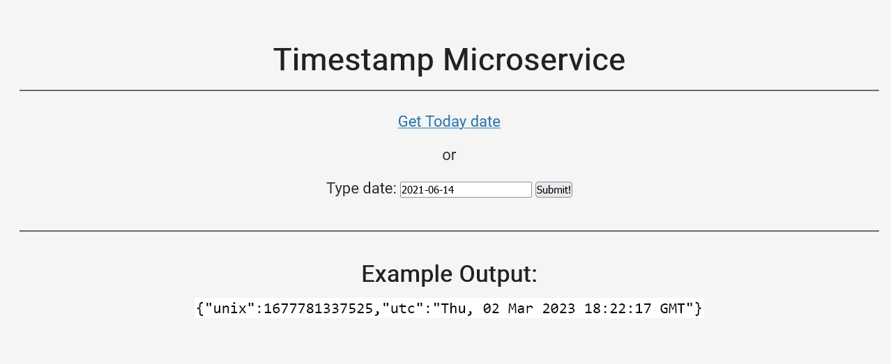

# TS node demo



[View the live Site here](https://ts-node-demo.onrender.com/)

> NOTE: I am on the free plan of render, the app will go sleep after 15 minutes of being inactive, so the start up may be slow.

This is a demo app that I am getting familiar with the process of how to run the node app with TypeScript and then deploy on [render](https://render.com/).

** folder structure**

```
|-- public
  |-- style.css
|-- src
  |-- controllers
    |-- timeController.ts
  |-- routes
    |-- timeRoutes.ts
  |-- index.ts
|-- views`
  |-- index.html
```

## Tech Stack

  

## Installation

```bash
git clone git@github.com:victoriacheng15/ts-node-demo.git
```

```bash
cd ts-node-demo
```

```bash
# If you are using `npm` or `yarn`
rm -rf pnpm-lock.yaml

npm/yarn install

# If you use pnpm
pnpm install
```

## What I have learned

I learned that there are a couple of ways to run the TS node app.

- concurrently
- nodemon
- ts-node-dev

Overall, I like the `concurrently` method since it installs fewer packages and one less config file e.g. `nodemon.json`.

## Source

The app idea was borrowed from freeCodeCamp - `Back End Development and APIs`.

- [Basic Express Server Setup with TypeScript - concurrently method](https://www.appliz.fr/blog/express-typescript)
- [How to Setup a TypeScript + Node.js Project - nodemon method](https://khalilstemmler.com/blogs/typescript/node-starter-project/)
- [concurrently](https://www.npmjs.com/package/concurrently)
- [ts-node-dev](https://www.npmjs.com/package/ts-node-dev)
